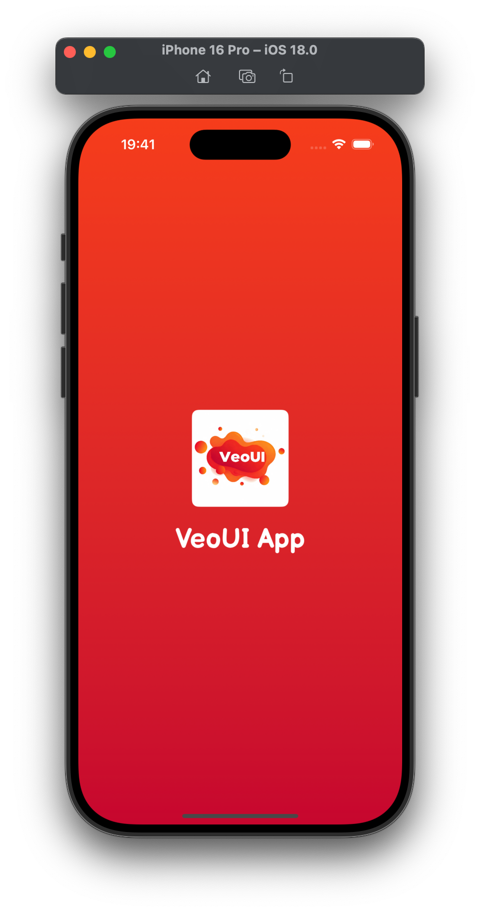
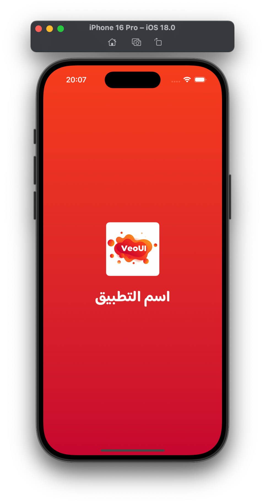
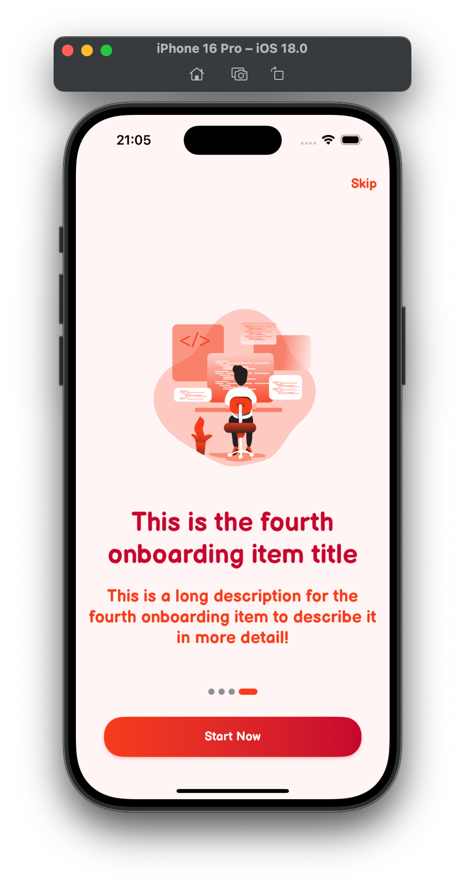
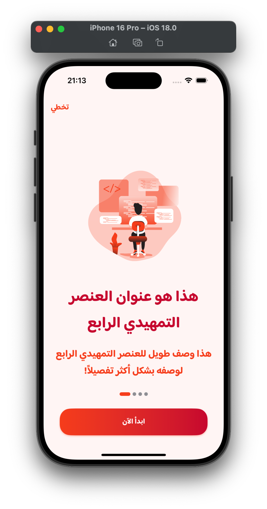
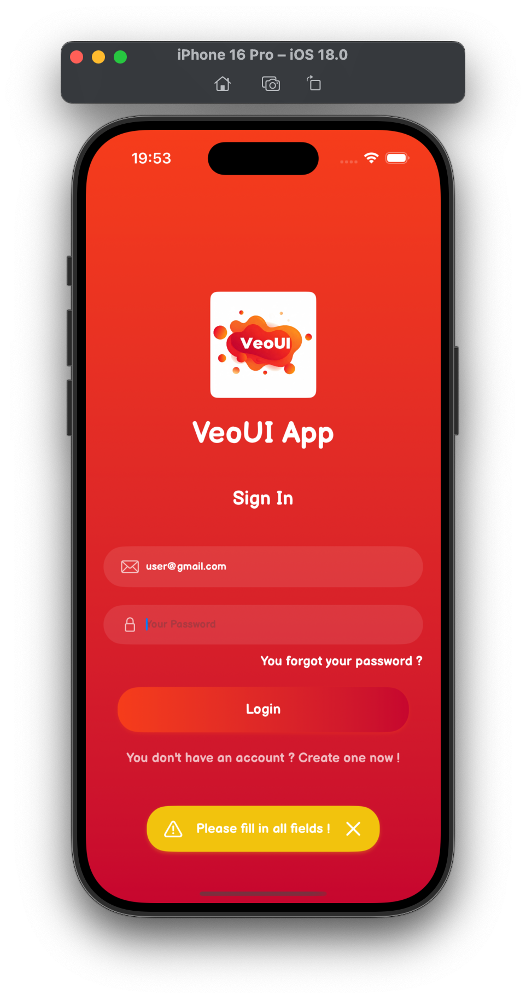
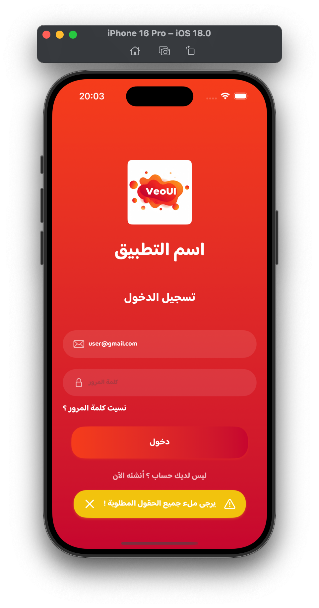

# VeoUI
> A comprehensive, customizable, and production-ready Flutter UI components library designed for building modern applications with ease


<div align="center">
    
</div>

## Features

- 🔧 **Highly Customizable**
- ♿️ **Accessibility First**
- 🌍 **RTL Support**
- 🎯 **Flutter 3.0+**

## Installation

Add VeoUI to your `pubspec.yaml`:

```yaml
dependencies:
  veoui: ^0.9.0
```

Or run this command:
```bash
flutter pub add veoui
```

## Example App

Check out the [example](example) directory for a fully functional demo app showcasing all components and features.

## Configuration

Before using VeoUI Library components, configure it with your custom settings:

```dart
import 'package:flutter/material.dart';
import 'package:veoui/veoui.dart';

void main() {
  
  VeoUI.configure(
    mainFont: "Rubik",
    primaryColor: HexColor("#f53d1b"),
    primaryDarkColor: HexColor("#c6062e"),
    isRTL: true,
  );
  
  runApp(const MyApp());
}
```

## Usage

### Basic Example

```dart
import 'package:flutter/material.dart';
import 'package:veoui/veoui.dart';

class MyHomePage extends StatelessWidget {
  const MyHomePage({super.key});
  @override
  Widget build(BuildContext context) {
    return Scaffold(
      body: Center(
        child: VeoButton(
          title: "Custom Gradient + Shape",
          shape: VeoButtonShape.rounded,
          elevation: 4,
          gradientColors: const [
            Color(0xFF16a085),
            Color(0xFF2ecc71),
          ],
          onPressed: () {
            print("Button tapped");
          },
        ),
      ),
    );
  }
}
```

## Components

### Screens

#### VeoSplash

<table>
<tr>
<th colspan="2">Code</th>
</tr>
<tr>
<td colspan="2">

```dart
import 'package:flutter/material.dart';
import 'package:veoui/veoui.dart';

class SplashScreen extends StatelessWidget {
  const SplashScreen({Key? key}) : super(key: key);

  @override
  Widget build(BuildContext context) {
    return VeoSplash(
        title: "App Name",
        appLogo: "assets/images/logo.png",
        onFinished: () {
          Navigator.pushNamed(context, '/onboarding');
        }
    );
  }
}
```
</td>
</tr>
<tr>
<th>Screenshot (LTR)</th>
<th>Screenshot (RTL)</th>
</tr>
<tr>
<td>

</td>
<td>

</td>
</tr>
</table>

#### VeoOnboarding

<table>
<tr>
<th colspan="2">Code</th>
</tr>
<tr>
<td colspan="2">

```dart
import 'package:flutter/material.dart';
import 'package:veoui/veoui.dart';

class OnboardingScreen extends StatelessWidget {
  const OnboardingScreen({Key? key}) : super(key: key);

  @override
  Widget build(BuildContext context) {
    return VeoOnboarding(
      items: [
        OnboardingItem(
          title: "مرحباً بك في تطبيقنا",
          description:
          "نحن سعداء بانضمامك إلينا، دعنا نتعرف على المميزات الرئيسية للتطبيق",
          image: "assets/images/onboarding1.png",
        ),
        OnboardingItem(
          title: "تصفح بسهولة",
          description:
          "واجهة سهلة الاستخدام تمكنك من الوصول إلى جميع الخدمات بكل سلاسة",
          image: "assets/images/onboarding2.png",
        ),
        OnboardingItem(
          title: "خدمات متكاملة",
          description:
          "نقدم لك مجموعة متكاملة من الخدمات المصممة خصيصاً لتلبية احتياجاتك",
          image: "assets/images/onboarding3.png",
        ),
        OnboardingItem(
          title: "ابدأ رحلتك معنا",
          description: "كل شيء جاهز الآن! دعنا نبدأ هذه الرحلة المميزة معاً",
          image: "assets/images/onboarding4.png",
        ),
      ],
      skipButtonText: "تخطي",
      nextButtonText: "التالي",
      getStartedButtonText: "ابدأ الآن",
      onFinish: () {
        // SharedPreferences.setBool('hasCompletedOnboarding', true);
        Navigator.pushReplacementNamed(context, '/login');
      },
    );
  }
}
```
</td>
</tr>
<tr>
<th>Screenshot (LTR)</th>
<th>Screenshot (RTL)</th>
</tr>
<tr>
<td>

</td>
<td>

</td>
</tr>
</table>

#### VeoLogin

<table>
<tr>
<th colspan="2">Code</th>
</tr>
<tr>
<td colspan="2">

```dart
import 'package:flutter/material.dart';
import 'package:veoui/veoui.dart';

class LoginScreen extends StatelessWidget {
  const LoginScreen({Key? key}) : super(key: key);

  Future<void> _simulateDelay() async {
    await Future.delayed(const Duration(seconds: 4));
  }

  @override
  Widget build(BuildContext context) {
    return VeoLogin(
      appName: "اسم التطبيق",
      appLogo: "assets/images/logo.png",
      title: "تسجيل الدخول",
      emailPlaceholder: "البريد الإلكتروني",
      passwordPlaceholder: "كلمة المرور",
      loginButtonTitle: "دخول",
      forgotPasswordButtonTitle: "هل نسيت كلمة المرور؟",
      dontHaveAccountButtonTitle: "ليس لديك حساب؟ سجل الآن!",
      showToast: true,
      pleaseFillInAllFieldsToastMessage: "يرجى ملء جميع الحقول!",
      onLoginTapped: (email, password) async {
        await _simulateDelay();
      },
      onRegisterTapped: () {
        Navigator.pushNamed(context, '/register');
      },
      onForgotPasswordTapped: () {
        Navigator.pushNamed(context, '/reset-password');
      },
      onLoginSuccess: () {
        Navigator.pushReplacementNamed(context, '/profile');
      },
      onLoginError: (error) {
        debugPrint("خطأ في تسجيل الدخول: $error");
      },
    );
  }
}

```
</td>
</tr>
<tr>
<th>Screenshot (LTR)</th>
<th>Screenshot (RTL)</th>
</tr>
<tr>
<td>

</td>
<td>

</td>
</tr>
</table>

## Contributing

1. Fork the repository
2. Create your feature branch (`git checkout -b feature/AmazingFeature`)
3. Commit your changes (`git commit -m 'Add some AmazingFeature'`)
4. Push to the branch (`git push origin feature/AmazingFeature`)
5. Open a Pull Request

## Support

For issues and feature requests, please file an issue on GitHub.

## License

This project is licensed under the Apache License 2.0 - see the [LICENSE](LICENSE) file for details.